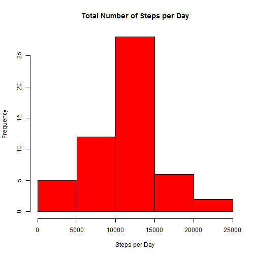
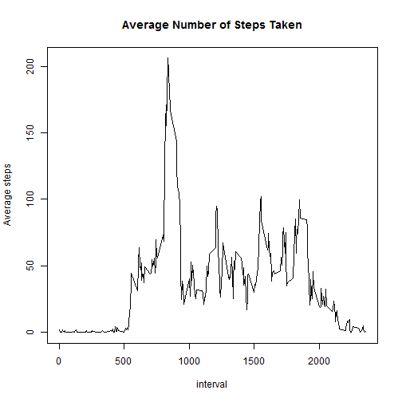
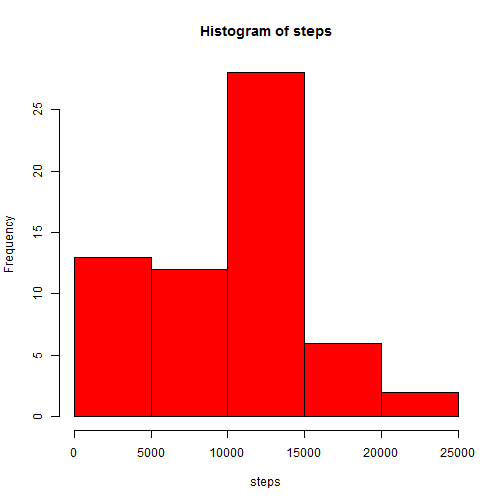
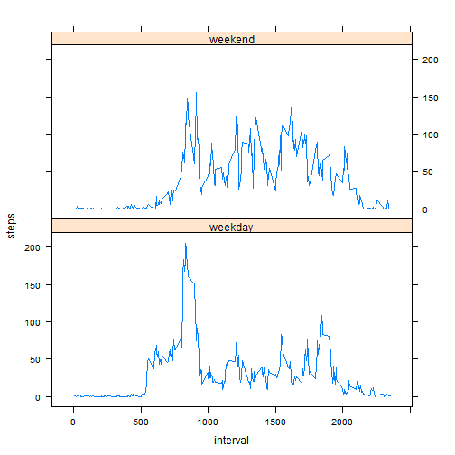

## Loading and preprocessing the data
After forking and cloning [this](https://github.com/rdpeng/RepData_PeerAssessment1) repository, set the working directory in R.   

```r
setwd("./RepData_PeerAssessment1") 
```
Load the data into R:

```r
activity <- read.csv(file=unzip("activity.zip"))  
activity$date <- as.Date(as.character(activity$date, "%Y-%m-%d"))
```
## What is mean total number of steps taken per day?
The total number of steps taken per day:

```r
with(activity, tapply(steps, date, sum, na.rm=T))
```

```
## 2012-10-01 2012-10-02 2012-10-03 2012-10-04 2012-10-05 2012-10-06 
##          0        126      11352      12116      13294      15420 
## 2012-10-07 2012-10-08 2012-10-09 2012-10-10 2012-10-11 2012-10-12 
##      11015          0      12811       9900      10304      17382 
## 2012-10-13 2012-10-14 2012-10-15 2012-10-16 2012-10-17 2012-10-18 
##      12426      15098      10139      15084      13452      10056 
## 2012-10-19 2012-10-20 2012-10-21 2012-10-22 2012-10-23 2012-10-24 
##      11829      10395       8821      13460       8918       8355 
## 2012-10-25 2012-10-26 2012-10-27 2012-10-28 2012-10-29 2012-10-30 
##       2492       6778      10119      11458       5018       9819 
## 2012-10-31 2012-11-01 2012-11-02 2012-11-03 2012-11-04 2012-11-05 
##      15414          0      10600      10571          0      10439 
## 2012-11-06 2012-11-07 2012-11-08 2012-11-09 2012-11-10 2012-11-11 
##       8334      12883       3219          0          0      12608 
## 2012-11-12 2012-11-13 2012-11-14 2012-11-15 2012-11-16 2012-11-17 
##      10765       7336          0         41       5441      14339 
## 2012-11-18 2012-11-19 2012-11-20 2012-11-21 2012-11-22 2012-11-23 
##      15110       8841       4472      12787      20427      21194 
## 2012-11-24 2012-11-25 2012-11-26 2012-11-27 2012-11-28 2012-11-29 
##      14478      11834      11162      13646      10183       7047 
## 2012-11-30 
##          0
```
A histogram of the total number of steps taken per day:

```r
sumsteps <- aggregate(steps~date, data=activity, sum)
hist(sumsteps$steps, col="red", main="Total Number of Steps per Day",
     xlab="Steps per Day")   
```

 

The mean and median of the total number of steps taken per day:

```r
mean(sumsteps$steps)
```

```
## [1] 10766.19
```

```r
median(sumsteps$steps)
```

```
## [1] 10765
```
## What is the average daily activity pattern?
Calculation of the average number of steps per interval followed by a time series plot of the 5-minute interval and the average number of steps:  

```r
meansteps <- aggregate(steps~interval, data=activity, mean) 
with(meansteps, plot(interval, steps, type="l", 
    main="Average Number of Steps Taken", ylab="Average steps"))   
```

 

The 5-minute interval with the maximum number of steps:

```r
meansteps[which.max(meansteps$steps), 1]  
```

```
## [1] 835
```
## Imputing missing values
Total number of NA values:

```r
sum(is.na(activity))
```

```
## [1] 2304
```
Imputing the NA values with the median of the steps per interval:

```r
mediansteps <- aggregate(steps~interval, data=activity, median)
missing <- activity[is.na(activity$steps), ]
imputed1 <- merge(missing, mediansteps, by="interval")
imputed1 <- imputed1[order(imputed1$date), ]
activity1 <- activity
activity1[is.na(activity1$steps), 1] <- imputed1$steps.y
```
Histogram of the total number of steps taken each day from imputed data:

```r
newsumsteps <- aggregate(steps~date, data=activity1, sum)
with(newsumsteps, hist(steps, col="red"))  
```

 

The mean and median of the total number of steps taken per day:

```r
mean(newsumsteps$steps)
```

```
## [1] 9503.869
```

```r
median(newsumsteps$steps)
```

```
## [1] 10395
```
Imputing the data caused the mean and median to both decrease.  

The total number of steps per day using the imputed data:

```r
with(newsumsteps, tapply(steps, date, sum, na.rm=T))
```

```
## 2012-10-01 2012-10-02 2012-10-03 2012-10-04 2012-10-05 2012-10-06 
##       1141        126      11352      12116      13294      15420 
## 2012-10-07 2012-10-08 2012-10-09 2012-10-10 2012-10-11 2012-10-12 
##      11015       1141      12811       9900      10304      17382 
## 2012-10-13 2012-10-14 2012-10-15 2012-10-16 2012-10-17 2012-10-18 
##      12426      15098      10139      15084      13452      10056 
## 2012-10-19 2012-10-20 2012-10-21 2012-10-22 2012-10-23 2012-10-24 
##      11829      10395       8821      13460       8918       8355 
## 2012-10-25 2012-10-26 2012-10-27 2012-10-28 2012-10-29 2012-10-30 
##       2492       6778      10119      11458       5018       9819 
## 2012-10-31 2012-11-01 2012-11-02 2012-11-03 2012-11-04 2012-11-05 
##      15414       1141      10600      10571       1141      10439 
## 2012-11-06 2012-11-07 2012-11-08 2012-11-09 2012-11-10 2012-11-11 
##       8334      12883       3219       1141       1141      12608 
## 2012-11-12 2012-11-13 2012-11-14 2012-11-15 2012-11-16 2012-11-17 
##      10765       7336       1141         41       5441      14339 
## 2012-11-18 2012-11-19 2012-11-20 2012-11-21 2012-11-22 2012-11-23 
##      15110       8841       4472      12787      20427      21194 
## 2012-11-24 2012-11-25 2012-11-26 2012-11-27 2012-11-28 2012-11-29 
##      14478      11834      11162      13646      10183       7047 
## 2012-11-30 
##       1141
```
## Are there differences in activity patterns between weekdays and weekends?
Create the new column with factor variable with levels weekend and weekday:

```r
activity2 <- activity1
activity2$week <- ifelse(weekdays(activity2$date)=="Saturday" | 
            weekdays(activity2$date)=="Sunday", "weekend", "weekday")
activity2$week <- as.factor(activity2$week)
```
A time series panel plot of the 5-minute interval and the average number of steps taken, averaged across all weekday days and weekend days:

```r
meansteps2 <- aggregate(steps~interval + week, data=activity2, mean)
library(lattice)
xyplot(steps~interval | week, data=meansteps2, type = "l", layout=c(1, 2))
```

 
